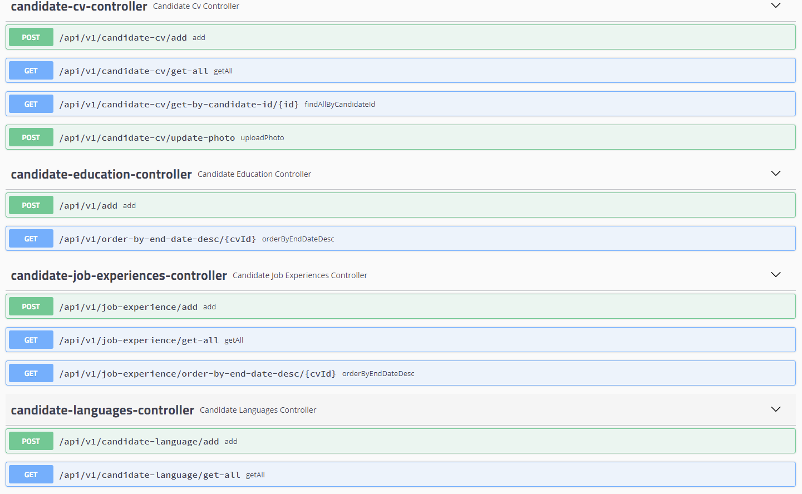

# Spring-React-HRMS
---
# HRMS Project with Spring Boot & React

---
# Used Technologies

- `PostgreSql`  
 
- `Spring Data JPA` 
  
- `Spring Hibernate Validator` 
 
- `Spring Web`  
 
- `Swagger` 
  
`Lombok`  
 
- `MapStruct`  
   
-  `Amazon S3`  
  
-  `Amazon Rekognition`  
  

 ---------------------------------
# API ENDPOINTS

